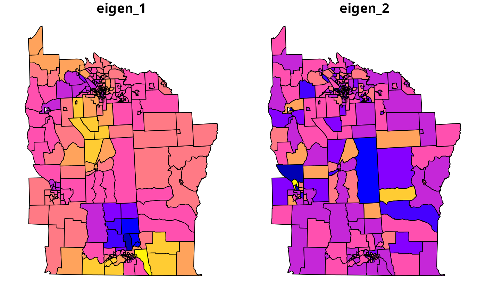

# Moran Eigenvectors

## Introduction [^1]

The Moran eigenvector approach ([Dray, Legendre, and Peres-Neto
2006](#ref-dray+legendre+peres-neto:06); [Griffith and Peres-Neto
2006](#ref-griffith+peres-neto:06)) involved the spatial patterns
represented by maps of eigenvectors; by choosing suitable orthogonal
patterns and adding them to a linear or generalised linear model, the
spatial dependence present in the residuals can be moved into the model.

It uses brute force to search the set of eigenvectors of the matrix
$`\mathbf{M W M}`$, where

\$\$\mathbf{M} = \mathbf{I} - \mathbf{X}(\mathbf{X}^{\rm T}
\mathbf{X})^{-1}\mathbf{X}^{\rm T}\$\$ is a symmetric and idempotent
projection matrix and $`\mathbf{W}`$ are the spatial weights. In the
spatial lag form of `SpatialFiltering` and in the GLM `ME` form below,
$`\mathbf{X}`$ is an $`n`$-vector of ones, that is the intercept only.

In its general form, `SpatialFiltering` chooses the subset of the $`n`$
eigenvectors that reduce the residual spatial autocorrelation in the
error of the model with covariates. The lag form adds the covariates in
assessment of which eigenvectors to choose, but does not use them in
constructing the eigenvectors. `SpatialFiltering` was implemented and
contributed by Yongwan Chun and Michael Tiefelsdorf, and is presented in
Tiefelsdorf and Griffith ([2007](#ref-tiefelsdorf+griffith:07)); `ME` is
based on Matlab code by Pedro Peres-Neto and is discussed in Dray,
Legendre, and Peres-Neto ([2006](#ref-dray+legendre+peres-neto:06)) and
Griffith and Peres-Neto ([2006](#ref-griffith+peres-neto:06)).

``` r
library(spdep)
require("sf", quietly=TRUE)
if (packageVersion("spData") >= "2.3.2") {
    NY8 <- sf::st_read(system.file("shapes/NY8_utm18.gpkg", package="spData"))
} else {
    NY8 <- sf::st_read(system.file("shapes/NY8_bna_utm18.gpkg", package="spData"))
    sf::st_crs(NY8) <- "EPSG:32618"
    NY8$Cases <- NY8$TRACTCAS
}
```

    ## Reading layer `NY8_utm18' from data source 
    ##   `/home/rsb/lib/r_libs/spData/shapes/NY8_utm18.gpkg' using driver `GPKG'
    ## Simple feature collection with 281 features and 17 fields
    ## Geometry type: POLYGON
    ## Dimension:     XY
    ## Bounding box:  xmin: 358241.9 ymin: 4649755 xmax: 480393.1 ymax: 4808545
    ## Projected CRS: WGS 84 / UTM zone 18N

``` r
NY_nb <- read.gal(system.file("weights/NY_nb.gal", package="spData"), override.id=TRUE)
```

``` r
library(spatialreg)
nySFE <- SpatialFiltering(Z~PEXPOSURE+PCTAGE65P+PCTOWNHOME, data=NY8, nb=NY_nb, style="W", verbose=FALSE)
nylmSFE <- lm(Z~PEXPOSURE+PCTAGE65P+PCTOWNHOME+fitted(nySFE), data=NY8)
summary(nylmSFE)
```

    ## 
    ## Call:
    ## lm(formula = Z ~ PEXPOSURE + PCTAGE65P + PCTOWNHOME + fitted(nySFE), 
    ##     data = NY8)
    ## 
    ## Residuals:
    ##     Min      1Q  Median      3Q     Max 
    ## -1.5184 -0.3523 -0.0105  0.3221  3.1964 
    ## 
    ## Coefficients:
    ##                    Estimate Std. Error t value Pr(>|t|)    
    ## (Intercept)        -0.51728    0.14606  -3.542 0.000469 ***
    ## PEXPOSURE           0.04884    0.03230   1.512 0.131717    
    ## PCTAGE65P           3.95089    0.55776   7.083 1.25e-11 ***
    ## PCTOWNHOME         -0.56004    0.15688  -3.570 0.000423 ***
    ## fitted(nySFE)vec13 -2.09397    0.60534  -3.459 0.000630 ***
    ## fitted(nySFE)vec44 -2.24003    0.60534  -3.700 0.000261 ***
    ## fitted(nySFE)vec6   1.02979    0.60534   1.701 0.090072 .  
    ## fitted(nySFE)vec38  1.29282    0.60534   2.136 0.033613 *  
    ## fitted(nySFE)vec20  1.10064    0.60534   1.818 0.070150 .  
    ## fitted(nySFE)vec14 -1.05105    0.60534  -1.736 0.083662 .  
    ## fitted(nySFE)vec75  1.90600    0.60534   3.149 0.001826 ** 
    ## fitted(nySFE)vec21 -1.06331    0.60534  -1.757 0.080138 .  
    ## fitted(nySFE)vec36 -1.17861    0.60534  -1.947 0.052578 .  
    ## fitted(nySFE)vec61 -1.08582    0.60534  -1.794 0.073986 .  
    ## ---
    ## Signif. codes:  0 '***' 0.001 '**' 0.01 '*' 0.05 '.' 0.1 ' ' 1
    ## 
    ## Residual standard error: 0.6053 on 267 degrees of freedom
    ## Multiple R-squared:  0.3401, Adjusted R-squared:  0.308 
    ## F-statistic: 10.58 on 13 and 267 DF,  p-value: < 2.2e-16

``` r
nylm <- lm(Z~PEXPOSURE+PCTAGE65P+PCTOWNHOME, data=NY8)
anova(nylm, nylmSFE)
```

    ## Analysis of Variance Table
    ## 
    ## Model 1: Z ~ PEXPOSURE + PCTAGE65P + PCTOWNHOME
    ## Model 2: Z ~ PEXPOSURE + PCTAGE65P + PCTOWNHOME + fitted(nySFE)
    ##   Res.Df     RSS Df Sum of Sq      F    Pr(>F)    
    ## 1    277 119.619                                  
    ## 2    267  97.837 10    21.782 5.9444 3.988e-08 ***
    ## ---
    ## Signif. codes:  0 '***' 0.001 '**' 0.01 '*' 0.05 '.' 0.1 ' ' 1

Since the `SpatialFiltering` approach does not allow weights to be used,
we see that the residual autocorrelation of the original linear model is
absorbed, or ‘whitened’ by the inclusion of selected eigenvectors in the
model, but that the covariate coefficients change little. The addition
of these eigenvectors – each representing an independent spatial pattern
– relieves the residual autocorrelation, but otherwise makes few changes
in the substantive coefficient values.

The `ME` function also searches for eigenvectors from the spatial lag
variant of the underlying model, but in a GLM framework. The criterion
is a permutation bootstrap test on Moran’s $`I`$ for regression
residuals, and in this case, because of the very limited remaining
spatial autocorrelation, is set at $`\alpha = 0.5`$. Even with this very
generous stopping rule, only few eigenvectors are chosen; their combined
contribution only just improves the fit of the GLM model.

``` r
NYlistwW <- nb2listw(NY_nb, style = "W")
set.seed(111)
```

``` r
nyME <- ME(Cases~PEXPOSURE+PCTAGE65P+PCTOWNHOME, data=NY8, offset=log(POP8), family="poisson", listw=NYlistwW, alpha=0.46)
```

``` r
nyME
```

    ##   Eigenvector ZI pr(ZI)
    ## 0          NA NA   0.31
    ## 1          24 NA   0.44
    ## 2         223 NA   0.42
    ## 3         206 NA   0.43
    ## 4         169 NA   0.48

``` r
NY8$eigen_1 <- fitted(nyME)[,1]
NY8$eigen_2 <- fitted(nyME)[,2]
```

``` r
#gry <- brewer.pal(9, "Greys")[-1]
plot(NY8[,c("eigen_1", "eigen_2")])
```



``` r
nyglmME <- glm(Cases~PEXPOSURE+PCTAGE65P+PCTOWNHOME+offset(log(POP8))+fitted(nyME), data=NY8, family="poisson")
summary(nyglmME)
```

    ## 
    ## Call:
    ## glm(formula = Cases ~ PEXPOSURE + PCTAGE65P + PCTOWNHOME + offset(log(POP8)) + 
    ##     fitted(nyME), family = "poisson", data = NY8)
    ## 
    ## Coefficients:
    ##                    Estimate Std. Error z value Pr(>|z|)    
    ## (Intercept)        -8.13431    0.18388 -44.237  < 2e-16 ***
    ## PEXPOSURE           0.14136    0.03134   4.511 6.45e-06 ***
    ## PCTAGE65P           4.16875    0.60149   6.931 4.19e-12 ***
    ## PCTOWNHOME         -0.39290    0.19222  -2.044  0.04096 *  
    ## fitted(nyME)vec24   1.62658    0.72243   2.252  0.02435 *  
    ## fitted(nyME)vec223  0.92941    0.70391   1.320  0.18671    
    ## fitted(nyME)vec206 -0.11559    0.68987  -0.168  0.86693    
    ## fitted(nyME)vec169  1.82674    0.68142   2.681  0.00735 ** 
    ## ---
    ## Signif. codes:  0 '***' 0.001 '**' 0.01 '*' 0.05 '.' 0.1 ' ' 1
    ## 
    ## (Dispersion parameter for poisson family taken to be 1)
    ## 
    ##     Null deviance: 428.25  on 280  degrees of freedom
    ## Residual deviance: 340.08  on 273  degrees of freedom
    ## AIC: Inf
    ## 
    ## Number of Fisher Scoring iterations: 5

``` r
nyGLMp <- glm(Cases~PEXPOSURE+PCTAGE65P+PCTOWNHOME+offset(log(POP8)), data=NY8,family="poisson")
anova(nyGLMp, nyglmME, test="Chisq")
```

    ## Analysis of Deviance Table
    ## 
    ## Model 1: Cases ~ PEXPOSURE + PCTAGE65P + PCTOWNHOME + offset(log(POP8))
    ## Model 2: Cases ~ PEXPOSURE + PCTAGE65P + PCTOWNHOME + offset(log(POP8)) + 
    ##     fitted(nyME)
    ##   Resid. Df Resid. Dev Df Deviance Pr(>Chi)  
    ## 1       277     353.35                       
    ## 2       273     340.08  4   13.269  0.01003 *
    ## ---
    ## Signif. codes:  0 '***' 0.001 '**' 0.01 '*' 0.05 '.' 0.1 ' ' 1

Figure 
``` math
fig:geigen2
```
shows the spatial patterns chosen to match the very small amount of
spatial autocorrelation remaining in the model. As with the other
Poisson regressions, the closeness to TCE sites is highly significant.
Since, however, many TCE sites are also in or close to more densely
populated urban areas with the possible presence of both point-source
and non-point-source pollution, it would be premature to take such
results simply at their face value. There is, however, a potentially
useful contrast between the cities of Binghamton in the south of the
study area with several sites in its vicinity, and Syracuse in the north
without TCE sites in this data set.

## References

Dray, S., P. Legendre, and P. R. Peres-Neto. 2006. “Spatial Modeling: A
Comprehensive Framework for Principle Coordinate Analysis of Neighbor
Matrices (PCNM).” *Ecological Modelling* 196: 483–93.

Griffith, D. A., and P. R. Peres-Neto. 2006. “Spatial Modeling in
Ecology: The Flexibility of Eigenfunction Spatial Analyses.” *Ecology*
87: 2603–13.

Tiefelsdorf, M., and D. A. Griffith. 2007. “Semiparametric Filtering of
Spatial Autocorrelation: The Eigenvector Approach.” *Environment and
Planning A* 39: 1193–1221.

[^1]: This vignette formed pp. 302–305 of the first edition of Bivand,
    R. S., Pebesma, E. and Gómez-Rubio V. (2008) Applied Spatial Data
    Analysis with R, Springer-Verlag, New York. It was retired from the
    second edition (2013) to accommodate material on other topics, and
    is made available in this form with the understanding of the
    publishers.
