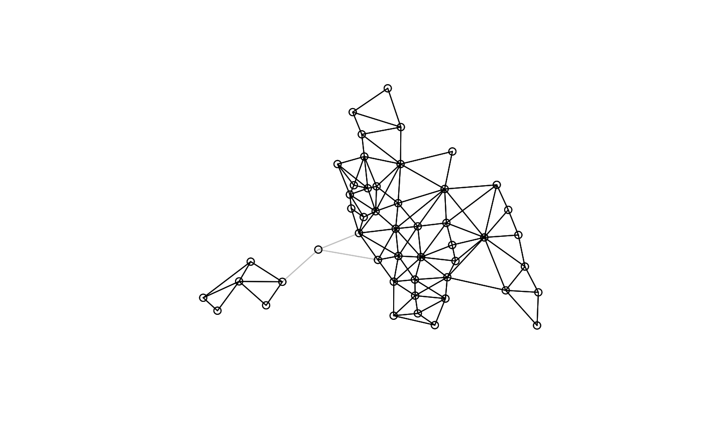
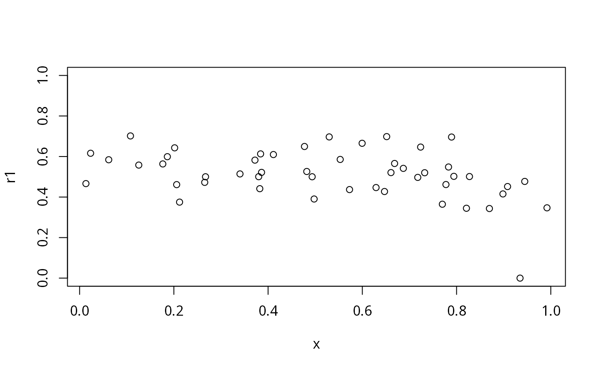

# Spatial weights objects as sparse matrices and graphs

## Introduction

Since the **spdep** package was created, *spatial weights* objects have
been constructed as lists with three components and a few attributes, in
old-style class `listw` objects. The first component of a `listw` object
is an `nb` object, a list of `n` integer vectors, with at least a
character vector `region.id` attribute with `n` unique values (like the
`row.names` of a `data.frame` object); `n` is the number of spatial
entities. Component `i` of this list contains the integer identifiers of
the neighbours of `i` as a sorted vector with no duplication and values
in `1:n`; if `i` has no neighbours, the component is a vector of length
`1` with value `0L`. The `nb` object may contain an attribute indicating
whether it is symmetric or not, that is whether `i` is a neighbour of
`j` implies that `j` is a neighbour of `i`. Some neighbour definitions
are symmetric by construction, such as contiguities or distance
thresholds, others are asymmetric, such as `k`-nearest neighbours. The
`nb` object redundantly stores both `i`-`j` and `j`-`i` links.

The second component of a `listw` object is a list of `n` numeric
vectors, each of the same length as the corresponding non-zero vectors
in the `nb`object. These give the values of the spatial weights for each
`i`-`j` neighbour pair. It is often the case that while the neighbours
are symmetric by construction, the weights are not, as for example when
weights are *row-standardised* by dividing each row of input weights by
the count of neighbours or cardinality of the neighbour set of `i`. In
the `nb2listw`function, it is also possible to pass through general
weights, such as inverse distances, shares of boundary lengths and so
on.

The third component of a `listw` object records the `style` of the
weights as a character code, with `"B"` for binary weights taking values
zero or one (only one is recorded), `"W"` for row-standardised weights,
and so on. In order to subset `listw` objects, knowledge of the `style`
may be necessary

It is obvious that this is similar to the way in which sparse matrices
are stored, either by row - like the `listw` object, or by column. The
key insight is that storing zero values is unnecessary, as we only need
to store the row and column locations of non-zero values. Early on, a
Netlib library was used to provide limited support in **spdep** for
sparse matrices, followed by functionality in **SparseM**, **spam**, and
**Matrix**.

From **spdep** and **spatialreg** versions 1.2, this vignette and
accompanying functionality has been moved to **spatialreg**.

### **spatialreg** depends on **Matrix**

Since **Matrix** is a recommended package, its functionality has
increasingly been used over time, and it has become one of two packages
on which **spatialreg** depends. This is reported on loading:

``` r
library(spatialreg)
```

    ## Loading required package: spData

    ## Loading required package: Matrix

    ## Loading required package: sf

    ## Linking to GEOS 3.14.1, GDAL 3.12.3, PROJ 9.9.0; sf_use_s2() is TRUE

### Getting some data

The legacy Columbus OH data set has 49 spatial entities, polygons,
defined as the boundaries of policing districts in the city.
**spatialreg** imports from **spdep** which in turn depends on **sf**.

``` r
dothis <- TRUE
if (!suppressPackageStartupMessages(require(sf, quietly=TRUE))) {
  message("install the sf package")
  dothis <- FALSE
}
if (dothis) {
  sf_extSoftVersion()
}
```

    ##           GEOS           GDAL         proj.4 GDAL_with_GEOS     USE_PROJ_H 
    ##       "3.14.1"       "3.12.3"        "9.9.0"         "true"         "true" 
    ##           PROJ 
    ##        "9.9.0"

``` r
library(sf)
columbus <- st_read(system.file("shapes/columbus.gpkg", package="spData")[1])
```

    ## Reading layer `columbus' from data source 
    ##   `/home/rsb/lib/r_libs/spData/shapes/columbus.gpkg' using driver `GPKG'
    ## Simple feature collection with 49 features and 20 fields
    ## Geometry type: POLYGON
    ## Dimension:     XY
    ## Bounding box:  xmin: 5.874907 ymin: 10.78863 xmax: 11.28742 ymax: 14.74245
    ## Projected CRS: Undefined Cartesian SRS with unknown unit

``` r
row.names(columbus)[1:10]
```

    ##  [1] "1"  "2"  "3"  "4"  "5"  "6"  "7"  "8"  "9"  "10"

### Finding contiguous neighbours and droppping links

Contiguous neighbours are often used for polygonal spatial entities,
here with the **poly2nb** function defaulting to the *queen* criterion -
entities are neighbours if they share a boundary point. We see that the
entity IDs are copied across to the `nb` object:

``` r
nb_q <- spdep::poly2nb(columbus)
nb_q
```

    ## Neighbour list object:
    ## Number of regions: 49 
    ## Number of nonzero links: 236 
    ## Percentage nonzero weights: 9.829238 
    ## Average number of links: 4.816327

``` r
attr(nb_q, "region.id")[1:10]
```

    ##  [1] "1"  "2"  "3"  "4"  "5"  "6"  "7"  "8"  "9"  "10"

``` r
spdep::is.symmetric.nb(nb_q)
```

    ## [1] TRUE

In order to make the object more complicated, let us drop the neighbour
links for the 21st entity (noting that the print method reports the ID
of the entity with no neighbours, not its number in `1:n`), and plot the
resulting map of neighbours:

``` r
col2 <- spdep::droplinks(nb_q, 21)
```

    ## Warning in spdep::droplinks(nb_q, 21): some observations have no neighbours

    ## Warning in spdep::droplinks(nb_q, 21): neighbour object has 3 sub-graphs

``` r
nb_q[[21]]
```

    ## [1] 24 30 34

``` r
col2[[21]]
```

    ## [1] 0

``` r
col2
```

    ## Neighbour list object:
    ## Number of regions: 49 
    ## Number of nonzero links: 230 
    ## Percentage nonzero weights: 9.579342 
    ## Average number of links: 4.693878 
    ## 1 region with no links:
    ## 21
    ## 3 disjoint connected subgraphs

``` r
spdep::is.symmetric.nb(col2)
```

    ## [1] TRUE

``` r
coords <- st_coordinates(st_centroid(st_geometry(columbus)))
plot(nb_q, coords, col="grey")
plot(col2, coords, add=TRUE)
```



## Using sparse matrices to represent spatial weights

At present only `listw` objects can be coerced to objects of classes
defined in **Matrix**. Because the `style` is lost on coercion, it may
not be possible to reconstruct spatial weights as the sparse matrix
representation does not preserve it. We will start with symmetric binary
weights, first creating a spatial weights object, and signalling that
one entity has no neighbours with the `zero.policy` argument (default
false). The matrix and graph representations of no-neighbour entities
are not obvious.

``` r
nb_B <- spdep::nb2listw(col2, style="B", zero.policy=TRUE)
nb_B$style
```

    ## [1] "B"

### Symmetric sparse matrices

**spdep** provides coercion methods from `listw` to the
`"symmetricMatrix"`, `"RsparseMatrix"` and `"CsparseMatrix"` classes
defined in **Matrix**. The `"RsparseMatrix"` is the representation that
is most similar to `listw`, as it is row-based, but it is used less
frequently in operations on sparse matrices. The entity IDs are passed
using sparse matrix row and column names at present. Here we believe
that our `listw` object can be represented as a symmetric matrix,
storing only a triangle rather than both `i`-`j` and `j`-`i` weights.
The coercion method does check whether symmetry is present before
proceeding:

``` r
library(spatialreg)
library(Matrix)
B <- as(nb_B, "CsparseMatrix")
all(B == t(B))
```

    ## [1] TRUE

``` r
str(B)
```

    ## Formal class 'dgCMatrix' [package "Matrix"] with 6 slots
    ##   ..@ i       : int [1:230] 1 2 0 2 3 0 1 3 4 1 ...
    ##   ..@ p       : int [1:50] 0 2 5 9 13 21 23 27 33 41 ...
    ##   ..@ Dim     : int [1:2] 49 49
    ##   ..@ Dimnames:List of 2
    ##   .. ..$ : chr [1:49] "1" "2" "3" "4" ...
    ##   .. ..$ : chr [1:49] "1" "2" "3" "4" ...
    ##   ..@ x       : num [1:230] 1 1 1 1 1 1 1 1 1 1 ...
    ##   ..@ factors : list()

``` r
rownames(B)[1:10]
```

    ##  [1] "1"  "2"  "3"  "4"  "5"  "6"  "7"  "8"  "9"  "10"

Let us now try to retreive the list of neighbours from the symmetric
sparse matrix. At present, we have to coerce from one **Matrix**
internal representation to another in order to get to the `"dgCMatrix"`
format used inside `mat2listw`, so we coerce to `"dgTMatrix"` from
`"dsTMatrix"`. The style is not retreived automatically, but is set to
`"M"` to indicate conversion from a matrix. The neighbour links are
retreived correctly, as are the IDs:

``` r
nb_B1 <- spdep::mat2listw(as(as(B, "TsparseMatrix"), "CsparseMatrix"),
    style="B", zero.policy=TRUE)
```

    ## Warning in sn2listw(df, style = style, zero.policy = zero.policy,
    ## from_mat2listw = TRUE): neighbour object has 3 sub-graphs

    ## Warning in spdep::mat2listw(as(as(B, "TsparseMatrix"), "CsparseMatrix"), :
    ## neighbour object has 3 sub-graphs

``` r
nb_B1$style
```

    ## [1] "B"

``` r
all.equal(nb_B1$neighbours, col2, check.attributes=FALSE)
```

    ## [1] TRUE

``` r
all.equal(attr(nb_B1$neighbours, "region.id"), attr(nb_B$neighbours, "region.id"))
```

    ## [1] TRUE

### Log determinants (symmetric weights) used in spatial regression

An initial reason for implementing support for sparse weights matrices
in **spdep** was to permit the calculation of the log determinant term
in spatial regressions for larger data sets. Using the eigenvalue
approach with for example
[`spatialreg::eigenw`](https://r-spatial.github.io/spatialreg/reference/eigenw.md)
is limited by the need to operate on dense matrices in memory to solve
the eigenproblem:

``` r
rho <- 0.1
do_spatialreg <- FALSE
if (requireNamespace("spatialreg", quietly=TRUE)) do_spatialreg <- TRUE
if (do_spatialreg) sum(log(1 - rho * spatialreg::eigenw(nb_B)))
```

    ## [1] -1.44787

When `n` is large, this may become impractical and/or time-consuming,
but does permit the rapid calculation of values of the log determinant
for differing values of the spatial coefficient $`\rho`$. The **Matrix**
package provides many `determinant` methods, here for a `"dsCMatrix"`
resulting from subtracting a `"dsCMatrix"`, the product of a scalar and
a `"dsTMatrix"`, from a `"ddiMatrix"`. The value of the log determinant
follows, calling a sparse Cholesky decomposition internally for suitable
input matrices.

``` r
n <- nrow(B)
I <- Diagonal(n)
class(I - rho * B)
```

    ## [1] "dgCMatrix"
    ## attr(,"package")
    ## [1] "Matrix"

``` r
c(determinant(I - rho * B, logarithm=TRUE)$modulus)
```

    ## [1] -1.44787

The computation of a sparse Cholesky decomposition for each value of the
spatial coefficient $`\rho`$ may be avoided by updating a pre-computed
object; this approach provides fast and accurate log determinants for
larger (but not very large) data sets:

``` r
nW <- -B
nChol <- Cholesky(nW, Imult=8)
n * log(rho) + (2 * c(determinant(update(nChol, nW, 1/rho), sqrt=TRUE)$modulus))
```

    ## [1] 15.40218

### Asymmetric sparse matrices

The use of row-standardisation leads to asymmetry even if the underlying
neighbours are symmetric, unless all entities have matching numbers of
neighbours (for example a regular grid on a torus):

``` r
nb_W <- spdep::nb2listw(col2, style="W", zero.policy=TRUE)
W <- as(nb_W, "CsparseMatrix")
str(W)
```

    ## Formal class 'dgCMatrix' [package "Matrix"] with 6 slots
    ##   ..@ i       : int [1:230] 1 2 0 2 3 0 1 3 4 1 ...
    ##   ..@ p       : int [1:50] 0 2 5 9 13 21 23 27 33 41 ...
    ##   ..@ Dim     : int [1:2] 49 49
    ##   ..@ Dimnames:List of 2
    ##   .. ..$ : chr [1:49] "1" "2" "3" "4" ...
    ##   .. ..$ : chr [1:49] "1" "2" "3" "4" ...
    ##   ..@ x       : num [1:230] 0.333 0.25 0.5 0.25 0.25 ...
    ##   ..@ factors : list()

``` r
all(W == t(W))
```

    ## [1] FALSE

The `lag` method for `listw` objects is often used to create spatially
lagged values, and returns the same values as the vector given by the
product of the sparse general matrix and an input numeric vector. Note
that by setting `zero.policy` to `TRUE`, the spatial lag of entity 21,
which has no neighbours, is zero by construction:

``` r
set.seed(1)
x <- runif(n)
r1 <- as.numeric(W %*% x)
r2 <- lag(nb_W, x, zero.policy=TRUE)
all.equal(r1, r2, check.attributes=FALSE)
```

    ## [1] TRUE

``` r
plot(x, r1, ylim=c(0,1))
```



``` r
c(x[21], r1[21])
```

    ## [1] 0.9347052 0.0000000

### Log determinants (asymmetric weights) used in spatial regression

Calculating the log determinant for asymmetric weights (here with
symmetric neighbours and symmetry induced by non-constant numbers of
neighbours) may be carried out using eigenvalues as before, but the
result may be a complex vector (here it is not, as discussed below). The
appropriate `determinant` method for `"dgCMatrix"` objects uses an LU
decomposition internally:

``` r
rho <- 0.5
sum(log(1 - rho * eigenw(nb_W)))
```

    ## [1] -1.594376

``` r
class(I - rho * W)
```

    ## [1] "dgCMatrix"
    ## attr(,"package")
    ## [1] "Matrix"

``` r
c(determinant(I - rho * W, logarithm=TRUE)$modulus)
```

    ## [1] -1.594376

We can show the internal workings of the method as:

``` r
LU <- lu(I - rho * W)
sum(log(abs(diag(slot(LU, "U")))))
```

    ## [1] -1.594376

### Log determinants: symmetric by similarity

The `nb2listw` function stores components that can be employed to
transform the asymmetric weights matrix to symmetry by similarity,
permitting the same log determinant to be computed using less costly
numerical methods. The `"W"` style used the cardinalities of neighbour
sets (row sums) to introduce row standardisation, and they are stored as
an attribute:

``` r
d <- attr(nb_W$weights, "comp")$d
all.equal(d, spdep::card(col2))
```

    ## [1] TRUE

If we first restore the row-standarised matrix to its binary form (which
must be symmetric), we can pre- and post-multiply by the square roots of
the inverted neighbour counts, yielding a symmetric matrix with the
appropriate properties:

``` r
dW <- Diagonal(n, d) %*% W
all(dW == t(dW))
```

    ## [1] TRUE

``` r
isd <- Diagonal(n, 1/sqrt(d))
isd[21,21]
```

    ## [1] Inf

``` r
Ws <- as(isd %*% dW %*% isd, "symmetricMatrix")
rowSums(Ws)[21]
```

    ## [1] 0

``` r
class(Ws)
```

    ## [1] "dsCMatrix"
    ## attr(,"package")
    ## [1] "Matrix"

``` r
c(determinant(I - rho * Ws, logarithm=TRUE)$modulus)
```

    ## [1] -1.594376

As can be seen, the division by the square root of zero for entity 21 is
not a problem as the row of `dW` is zero. The transformation by
similarity permits the use of numerical methods for sparse symmetric
matrices (and equivalently for eigenvalues and dense matrices). Note
that this transformation is not available for intrinsically asymmetric
neighbours, or for intrinsically asymmetric general weights.

### Using `eigs` in **RSpectra** for finding some eigenvalues

In spatial regression, the domain of the spatial coefficient is given by
the inverse of the maximum and minimum eigenvalues. When `n` is
moderate, we have the eigenvalues anyway, so the interval for line
search is available without extra effort. When `n` is somewhat larger,
use may be made of the `eigs` function in **RSpectra**:

``` r
1/range(spatialreg::eigenw(nb_B))
```

    ## [1] -0.3212551  0.1638329

``` r
if (!require("RSpectra", quietly=TRUE)) dothis <- FALSE
```

``` r
1/c(eigs(B, k=1, which="SR")$values, eigs(B, k=1, which="LR")$values)
```

    ## [1] -0.3212551  0.1638329

In this case, the results are trivial with small `k`.

``` r
1/range(eigenw(nb_W))
```

    ## [1] -1.544645  1.000000

``` r
1/Re(c(eigs(W, k=1, which="SR")$values, eigs(W, k=1, which="LR")$values))
```

    ## [1] -1.544645  1.000000

Using row-standardisation has the nice feature of setting the upper
bound to unity, and there are graph methods for finding out whether the
lower bound is `-1`.

## Using **igraph** for spatial weights as graphs

### Converting from symmetric adjacency matrix to graph

First we’ll see how to get from sparse matrices to graphs. The mode of a
symmetric matrix is `"undirected"` by definition:

``` r
class(B)
```

    ## [1] "dgCMatrix"
    ## attr(,"package")
    ## [1] "Matrix"

``` r
object.size(B)
```

    ## 10824 bytes

``` r
if (!require("igraph", quietly=FALSE)) dothis <- FALSE
```

    ## Loading required package: igraph

    ## 
    ## Attaching package: 'igraph'

    ## The following objects are masked from 'package:stats':
    ## 
    ##     decompose, spectrum

    ## The following object is masked from 'package:base':
    ## 
    ##     union

``` r
g1 <- graph_from_adjacency_matrix(B, mode="undirected")
class(g1)
```

    ## [1] "igraph"

``` r
object.size(g1)
```

    ## 6544 bytes

### Converting from graph to symmetric adjacency matrix

We can also convert this graph back to the same matrix, but note that
`as_adjacency_matrix` chooses a particular class of sparse matrix to be
returned, so that the conversion process typically leads many matrices
to fewer graph types, and back to fewer matrix types:

``` r
# Matrix 1.4-2 vulnerability work-around
ow <- options("warn")$warn
options("warn"=2L)
B1 <- try(as_adjacency_matrix(g1), silent=TRUE)
if (!inherits(B1, "try-error")) print(class(B1))
```

    ## [1] "dgCMatrix"
    ## attr(,"package")
    ## [1] "Matrix"

``` r
if (!inherits(B1, "try-error")) print(object.size(B1))
```

    ## 10824 bytes

``` r
if (!inherits(B1, "try-error")) print(all.equal(B, as(B1, "CsparseMatrix")))
```

    ## [1] TRUE

``` r
options("warn"=ow)
```

### Graph components in **spdep**

A simple example of using **igraph** to do the same as an existing
**spdep** function is Nicholas Lewin-Koh’s `n.comp.nb` from the early
days of the package. It is useful to know whether an `nb` object is
divided up into separate subgraphs, and which entities are members of
which such subgraph.

``` r
res <- spdep::n.comp.nb(col2)
table(res$comp.id)
```

    ## 
    ##  1  2  3 
    ## 42  1  6

### Graph components in **igraph**

The same result can be obtained using the `clusters` function in
**igraph**:

``` r
c1 <- components(g1)
c1$no == res$nc
```

    ## [1] TRUE

``` r
all.equal(c1$membership, res$comp.id)
```

    ## [1] "names for target but not for current"

``` r
all.equal(c1$csize, c(table(res$comp.id)), check.attributes=FALSE)
```

    ## [1] TRUE

The same holds for the row-standardised variant:

``` r
W <- as(spdep::nb2listw(col2, style="W", zero.policy=TRUE), "CsparseMatrix")
g1W <- graph_from_adjacency_matrix(W, mode="directed", weighted="W")
c1W <- components(g1W)
all.equal(c1W$membership, res$comp.id)
```

    ## [1] "names for target but not for current"

### Shortest paths in weights matrices: **igraph**

Finding shortest paths between spatial entities across a given graph is
a way to express closeness. If the graph is connected, that is that it
is possible to traverse the graph edges from any node to any other, the
longest shortest path is then a useful measure. In **igraph**, the
`is.connected` function tells us tells us that our graph is not
connected, as we know from the figure above. The diameter measure is
then the diameter of the largest component subgraph. Note that this
generates an `n` x `n` matrix:

``` r
is_connected(g1)
```

    ## [1] FALSE

``` r
dg1 <- diameter(g1)
dg1
```

    ## [1] 7

``` r
sp_mat <- distances(g1)
str(sp_mat)
```

    ##  num [1:49, 1:49] 0 1 1 2 2 3 4 3 3 4 ...
    ##  - attr(*, "dimnames")=List of 2
    ##   ..$ : chr [1:49] "1" "2" "3" "4" ...
    ##   ..$ : chr [1:49] "1" "2" "3" "4" ...

### Shortest paths in weights matrices: **spdep**

If we do the same in **spdep**, using `nblag` to a maximum number of lag
orders - the diameter, but which is unknown in advance (the largest lag
order for which the number of links is greater than zero), we run into
the problem of how to represent missing neighbour information.

``` r
nbl10 <- spdep::nblag(col2, maxlag=10)
```

    ## Warning in spdep::nblag(col2, maxlag = 10): lag 1 neighbour object has 3
    ## sub-graphs

    ## Warning in spdep::nblag(col2, maxlag = 10): lag 2 neighbour object has 4
    ## sub-graphs

    ## Warning in spdep::nblag(col2, maxlag = 10): lag 3 neighbour object has 8
    ## sub-graphs

    ## Warning in spdep::nblag(col2, maxlag = 10): lag 4 neighbour object has 8
    ## sub-graphs

    ## Warning in spdep::nblag(col2, maxlag = 10): lag 5 neighbour object has 14
    ## sub-graphs

    ## Warning in spdep::nblag(col2, maxlag = 10): lag 6 neighbour object has 29
    ## sub-graphs

    ## Warning in spdep::nblag(col2, maxlag = 10): lag 7 neighbour object has 43
    ## sub-graphs

    ## Warning in spdep::nblag(col2, maxlag = 10): lag 8 neighbour object has 49
    ## sub-graphs

    ## Warning in spdep::nblag(col2, maxlag = 10): lag 9 neighbour object has 49
    ## sub-graphs

    ## Warning in spdep::nblag(col2, maxlag = 10): lag 10 neighbour object has 49
    ## sub-graphs

``` r
vals <- sapply(nbl10, function(x) sum(spdep::card(x)))
zero <- which(vals == 0)
zero[1]-1
```

    ## [1] 7

If we insert zero into the weights matrix where there is no connection
using `zero.policy=TRUE`, we generate a zero shortest path. If we are to
create a matrix that matches the one produced by `shortest.paths`, we
need to set all these non-structural zeros to infinity (the length of
the path between unconnected nodes), and re-instate structural zeros on
the diagonal:

``` r
lmat <- lapply(nbl10[1:(zero[1]-1)], spdep::nb2mat, style="B", zero.policy=TRUE)
mat <- matrix(0, n, n)
for (i in seq(along=lmat)) mat = mat + i*lmat[[i]]
mat[mat==0] <- Inf
diag(mat) <- 0
all.equal(mat, sp_mat, check.attributes=FALSE)
```

    ## [1] TRUE

### Smirnov/Anselin (2009) cyclical matrices

Another area in which a graph representation might prove useful is in
trying to establish the domain of the spatial coefficient when spatial
weights are row-standardised. In that case by construction we know that
the maximum eigenvalue is 1. If there are multiple blocks, that is graph
components, where the numbers of nodes per block are greater than 1,
then each will have a maximum eigenvalue of 1. The remaining problems
are the numbers of zero eigenvalues (at least the singleton graph
components), and whether any non-singleton component fulfills the
condition termed by Smirnov and Anselin (2009) a cyclical matrix, for
which the minimum eigenvalue is -1. The term cyclical appears to be used
in many different ways, and it is not clear that its use here after
Smirnov and Anselin (2009, pp. 2984-2985) indicates which meaning should
be used to find the relevant graph function. The definition used here is
that a block matrix (subgraph) is cyclical if: “for every location,
every pair of its neighbours are not connected.” That is, if w\[i,j\]
and w\[i,k\] are greater than zero, w\[j,k\] must be zero to meet the
condition.

The internal function find_q1_q2 returns the number of non-singleton
components, and the number of these that meet this condition. It does
this for each block/subgraph by testing the condition until it meets
w\[j,k\] \> 0, at which point it breaks. Smirnov and Anselin (2009)
state that rook neighbours on a regular grid meet the condition:

``` r
nb_r <- spdep::cell2nb(7, 7, type="rook")
nb_rW <- spdep::nb2listw(nb_r, style="W")
spdep:::find_q1_q2(nb_rW)
```

    ## [1] 1 1

One block/graph component is found, and this one meets the cyclical
matrix condition, as also shown by the domain:

``` r
1/range(Re(eigenw(similar.listw(nb_rW))))
```

    ## [1] -1  1

This does not apply to the spatial weights we have been using above,
with two non-singleton components, neither meeting the cyclical matrix
condition:

``` r
spdep:::find_q1_q2(nb_W)
```

    ## [1] 2 0

``` r
1/range(Re(eigenw(similar.listw(nb_W))))
```

    ## [1] -1.544645  1.000000

By construction, all two-node connected graph components also meet the
condition, as the eigenvalues sum to zero, and the maximum is unity, so
the minimum must be -1.
