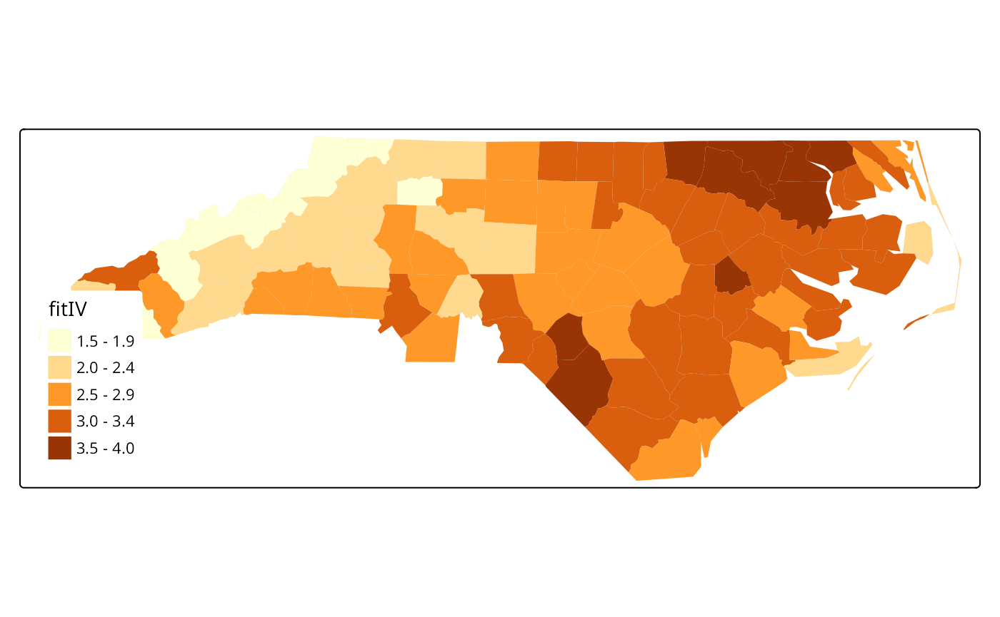

# North Carolina SIDS data set (models)

## Introduction

This data set was presented first in Symons, Grimson, and Yuan
([1983](#ref-symonsetal:1983)), analysed with reference to the spatial
nature of the data in Cressie and Read ([1985](#ref-cressie+read:1985)),
expanded in Cressie and Chan ([1989](#ref-cressie+chan:1989)), and used
in detail in Cressie ([1991](#ref-cressie:1991)). It is for the 100
counties of North Carolina, and includes counts of numbers of live
births (also non-white live births) and numbers of sudden infant deaths,
for the July 1, 1974 to June 30, 1978 and July 1, 1979 to June 30, 1984
periods. In Cressie and Read ([1985](#ref-cressie+read:1985)), a listing
of county neighbours based on shared boundaries (contiguity) is given,
and in Cressie and Chan ([1989](#ref-cressie+chan:1989)), and in Cressie
([1991, 386–89](#ref-cressie:1991)), a different listing based on the
criterion of distance between county seats, with a cutoff at 30 miles.
The county seat location coordinates are given in miles in a local
(unknown) coordinate reference system. The data are also used to
exemplify a range of functions in the spatial statistics module user’s
manual ([Kaluzny et al. 1996](#ref-kaluznyetal:1996)).

## Getting the data into R

We will be using the **spdep** and **spatialreg** packages, here
version: spdep, version 1.4-2, 2026-02-13, the **sf** package and the
**tmap** package. The data from the sources referred to above is
documented in the [help
page](https://jakubnowosad.com/spData/reference/nc.sids.html) for the
`nc.sids` data set in **spData**. The actual data, included in a
shapefile of the county boundaries for North Carolina were made
available in the **maptools** package [^1]. These data are known to be
geographical coordinates (longitude-latitude in decimal degrees) and are
assumed to use the NAD27 datum.

``` r
library(spdep)
nc <- st_read(system.file("shapes/sids.gpkg", package="spData")[1], quiet=TRUE)
#st_crs(nc) <- "+proj=longlat +datum=NAD27"
row.names(nc) <- as.character(nc$FIPSNO)
```

``` r
nc$ft.SID74 <- sqrt(1000)*(sqrt(nc$SID74/nc$BIR74) + sqrt((nc$SID74+1)/nc$BIR74))
nc$both <- factor(paste(nc$L_id, nc$M_id, sep=":"))
```

We will now examine the data set reproduced from Cressie and
collaborators, included in **spData** (formerly in **spdep**), and add
the neighbour relationships used in Cressie and Chan
([1989](#ref-cressie+chan:1989)) to the background map as a graph shown
in Figure :

``` r
gal_file <- system.file("weights/ncCC89.gal", package="spData")[1]
ncCC89 <- read.gal(gal_file, region.id=nc$FIPSNO)
```

### CAR model fitting

We will now try to replicate three of the four models fitted by
([Cressie and Chan 1989](#ref-cressie+chan:1989)) to the transformed
rates variable. The first thing to do is to try to replicate their 30
mile distance between county seats neighbours, which almost works. From
there we try to reconstruct three of the four models they fit,
concluding that we can get quite close, but that a number of questions
are raised along the way.

Building the weights is much more complicated, because they use a
combination of distance-metric and population-at-risk based weights, but
we can get quite close (see also [Kaluzny et al.
1996](#ref-kaluznyetal:1996)):

``` r
sids.nhbr30.dist <- nbdists(ncCC89, cbind(nc$east, nc$north))
sids.nhbr <- listw2sn(nb2listw(ncCC89, glist=sids.nhbr30.dist, style="B", zero.policy=TRUE))
dij <- sids.nhbr[,3]
n <- nc$BIR74
el1 <- min(dij)/dij
el2 <- sqrt(n[sids.nhbr$to]/n[sids.nhbr$from])
sids.nhbr$weights <- el1*el2
if (packageVersion("spdep") >= "1.3.1") {
  sids.nhbr.listw <- sn2listw(sids.nhbr, style="B", zero.policy=TRUE)
} else {
  sids.nhbr.listw <- sn2listw(sids.nhbr)
}
```

The first model (I) is a null model with just an intercept, the second
(II) includes all the 12 parcels of contiguous counties in 4 east-west
and 4 north-south bands, while the fourth (IV) includes the transformed
non-white birth-rate:

``` r
nc$ft.NWBIR74 <- sqrt(1000)*(sqrt(nc$NWBIR74/nc$BIR74) + sqrt((nc$NWBIR74+1)/nc$BIR74))
```

Cressie identifies Anson county as an outlier, and drops it from further
analysis. Because the weights are constructed in a complicated way, they
will be subsetted by dropping the row and column of the weights matrix:

``` r
lm_nc <- lm(ft.SID74 ~ 1, data=nc)
outl <- which.max(rstandard(lm_nc))
as.character(nc$NAME[outl])
```

    ## [1] "Anson"

``` r
W <- listw2mat(sids.nhbr.listw)
W.4 <- W[-outl, -outl]
sids.nhbr.listw.4 <- mat2listw(W.4)
nc2 <- nc[!(1:length(nc$CNTY_ID) %in% outl),]
```

It appears that both numerical issues (convergence in particular) and
uncertainties about the exact spatial weights matrix used make it
difficult to reproduce the results of Cressie and Chan
([1989](#ref-cressie+chan:1989)), also given in Cressie
([1991](#ref-cressie:1991)). We now try to replicate them for the null
weighted CAR model (Cressie has intercept 2.838, $`\hat{\theta}`$ 0.833,
for k=1):

``` r
library(spatialreg)
ecarIaw <- spautolm(ft.SID74 ~ 1, data=nc2, listw=sids.nhbr.listw.4, weights=BIR74, family="CAR")
summary(ecarIaw)
```

    ## 
    ## Call: spautolm(formula = ft.SID74 ~ 1, data = nc2, listw = sids.nhbr.listw.4, 
    ##     weights = BIR74, family = "CAR")
    ## 
    ## Residuals:
    ##       Min        1Q    Median        3Q       Max 
    ## -2.010292 -0.639658 -0.062209  0.443549  2.018065 
    ## 
    ## Coefficients: 
    ##             Estimate Std. Error z value  Pr(>|z|)
    ## (Intercept) 2.945323   0.095135  30.959 < 2.2e-16
    ## 
    ## Lambda: 0.86814 LR test value: 22.83 p-value: 1.7701e-06 
    ## Numerical Hessian standard error of lambda: 0.04838 
    ## 
    ## Log likelihood: -118.8432 
    ## ML residual variance (sigma squared): 1266.5, (sigma: 35.588)
    ## Number of observations: 99 
    ## Number of parameters estimated: 3 
    ## AIC: NA (not available for weighted model)

The spatial parcels model seems not to work, with Cressie’s
$`\hat{\theta}`$ 0.710, and failure in the numerical Hessian used to
calculate the standard error of the spatial coefficient:

``` r
ecarIIaw <- spautolm(ft.SID74 ~ both - 1, data=nc2, listw=sids.nhbr.listw.4, weights=BIR74, family="CAR")
summary(ecarIIaw)
```

    ## 
    ## Call: 
    ## spautolm(formula = ft.SID74 ~ both - 1, data = nc2, listw = sids.nhbr.listw.4, 
    ##     weights = BIR74, family = "CAR")
    ## 
    ## Residuals:
    ##      Min       1Q   Median       3Q      Max 
    ## -2.55896 -0.46338 -0.02035  0.38935  2.05682 
    ## 
    ## Coefficients: 
    ##         Estimate Std. Error z value  Pr(>|z|)
    ## both1:2  2.06223    0.20016 10.3031 < 2.2e-16
    ## both1:3  2.91823    0.14139 20.6400 < 2.2e-16
    ## both1:4  4.11486    0.29939 13.7439 < 2.2e-16
    ## both2:1  2.57650    0.26905  9.5762 < 2.2e-16
    ## both2:2  2.17403    0.18222 11.9305 < 2.2e-16
    ## both2:3  2.67397    0.15329 17.4443 < 2.2e-16
    ## both2:4  3.11361    0.24699 12.6062 < 2.2e-16
    ## both3:1  2.94400    0.29893  9.8486 < 2.2e-16
    ## both3:2  2.65391    0.14098 18.8250 < 2.2e-16
    ## both3:3  2.91619    0.17099 17.0552 < 2.2e-16
    ## both3:4  3.20425    0.20349 15.7468 < 2.2e-16
    ## both4:3  3.80286    0.20806 18.2781 < 2.2e-16
    ## 
    ## Lambda: 0.2109 LR test value: 1.3088 p-value: 0.25261 
    ## Numerical Hessian standard error of lambda: NaN 
    ## 
    ## Log likelihood: -99.25505 
    ## ML residual variance (sigma squared): 891.48, (sigma: 29.858)
    ## Number of observations: 99 
    ## Number of parameters estimated: 14 
    ## AIC: NA (not available for weighted model)

Finally, the non-white model repeats Cressie’s finding that much of the
variance of the transformed SIDS rate for 1974–8 can be accounted for by
the transformed non-white birth variable (Cressie intercept 1.644,
$`\hat{b}`$ 0.0346, $`\hat{\theta}`$ 0.640 — not significant), but the
estimate of the spatial coefficient is not close here:

``` r
ecarIVaw <- spautolm(ft.SID74 ~ ft.NWBIR74, data=nc2, listw=sids.nhbr.listw.4, weights=BIR74, family="CAR")
summary(ecarIVaw)
```

    ## 
    ## Call: 
    ## spautolm(formula = ft.SID74 ~ ft.NWBIR74, data = nc2, listw = sids.nhbr.listw.4, 
    ##     weights = BIR74, family = "CAR")
    ## 
    ## Residuals:
    ##      Min       1Q   Median       3Q      Max 
    ## -1.99056 -0.44858  0.15468  0.60623  1.95541 
    ## 
    ## Coefficients: 
    ##              Estimate Std. Error z value  Pr(>|z|)
    ## (Intercept) 1.4371519  0.2252729  6.3796 1.775e-10
    ## ft.NWBIR74  0.0408354  0.0062919  6.4902 8.572e-11
    ## 
    ## Lambda: 0.22391 LR test value: 1.1577 p-value: 0.28194 
    ## Numerical Hessian standard error of lambda: 0.55663 
    ## 
    ## Log likelihood: -114.0376 
    ## ML residual variance (sigma squared): 1201.5, (sigma: 34.663)
    ## Number of observations: 99 
    ## Number of parameters estimated: 4 
    ## AIC: NA (not available for weighted model)

``` r
nc2$fitIV <- fitted.values(ecarIVaw)
if (tmap4) {
  tm_shape(nc2) + tm_polygons(fill="fitIV", fill.scale=tm_scale(values="brewer.yl_or_br"), fill.legend=tm_legend(position=tm_pos_in("left", "bottom"), frame=FALSE, item.r = 0), lwd=0.01)
} else {
tm_shape(nc2) + tm_fill("fitIV")
}
```



The final figure shows the value of the log likelihood function for the
null model (I):

``` r
ecarIawll <- spautolm(ft.SID74 ~ 1, data=nc2, listw=sids.nhbr.listw.4, weights=BIR74, family="CAR", llprof=seq(-0.1, 0.9020532358, length.out=100))
plot(ll ~ lambda, ecarIawll$llprof, type="l")
```


## References

Cressie, N. 1991. *Statistics for Spatial Data*. New York: Wiley.

Cressie, N., and N. H. Chan. 1989. “Spatial Modelling of Regional
Variables.” *Journal of the American Statistical Association* 84:
393–401.

Cressie, N., and T. R. C. Read. 1985. “Do Sudden Infant Deaths Come in
Clusters?” *Statistics and Decisions* Supplement Issue 2: 333–49.

Kaluzny, S. P., S. C. Vega, T. P. Cardoso, and A. A. Shelly. 1996.
*S-PLUS SPATIALSTATS User’s Manual Version 1.0*. Seattle: MathSoft Inc.

Symons, M. J., R. C. Grimson, and Y. C. Yuan. 1983. “Clustering of Rare
Events.” *Biometrics* 39: 193–205.

[^1]: These data were taken with permission from a now-offline link:
    \[sal.agecon.uiuc.edu/datasets/sids.zip\]; see also [GeoDa
    Center](https://geodacenter.github.io/data-and-lab/) for a
    contemporary source.
